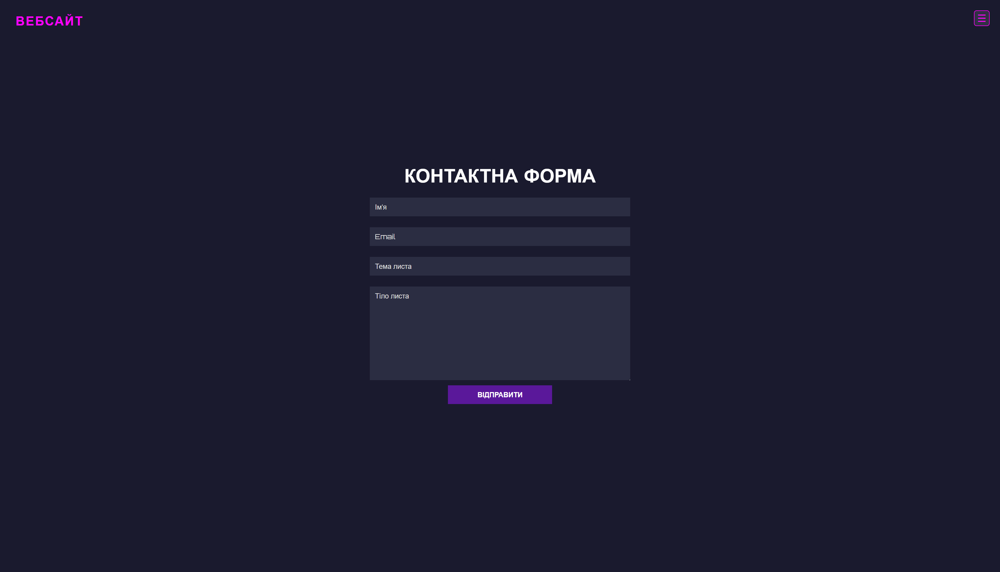

# Test Page — WordPress Шаблон

## Опис проекту

Шаблон **Test Page** — це тестовий шаблон з меню та контактною формою Contact Form з підтримкою інтеграції **ACF (Advanced Custom Fields)**. Шаблон створений з плавною навігацією та підтримкою форм через **Contact Form 7**.

---

## Використані технології

- **WordPress** — CMS, на якій базується шаблон.
- **Advanced Custom Fields (ACF)** — плагін для додаткових полів, який використовується для керування налаштуваннями лендінгу (наприклад, текст логотипу, заголовок контактної форми).
- **Contact Form 7** — плагін для створення та обробки контактних форм.
- **CSS** — кастомні стилі для оформлення теми, використовується шрифт Orbitron з Google Fonts.
- **JavaScript** — для реалізації функціоналу меню (відкриття/закриття), а також анімації підсвітки елементів.

---

## Структура теми

- `style.css` — основні стилі теми з футуристичним дизайном, темним режимом, та адаптивністю.
- `functions.php` — файл з реєстрацією меню, підключенням стилів і скриптів, а також інтеграцією ACF для створення сторінки налаштувань лендінгу.
- `header.php` та `footer.php` — шаблони верхнього і нижнього колонтитулів з викликом необхідних функцій WordPress (`wp_head()`, `wp_footer()`).
- Шаблон сторінки `template-test-contact.php` — спеціальний шаблон із виводом заголовку, логотипу, меню та контактної форми через шорткод Contact Form 7.

---

## Як встановити та налаштувати

1. **Встановіть WordPress** (якщо ще не встановлено).
2. Завантажте архів із шаблоном test-contact.zip та розархівуйте в директорію `/wp-content/themes/`.
3. Активуйте тему через адмін-панель WordPress у розділі **Зовнішній вигляд > Теми**.
4. Встановіть і активуйте плагіни:
   - **Advanced Custom Fields**
   - **Contact Form 7**
5. Створіть через Pages сторінку, де в Templates справа виберіть шаблон сторінки **Test Contact**.
6. Перейдіть до меню ACF > Field Groups , натисніть Add New , Додайте ім'я для New Field Group (Наприклад Test Page)
Додайте такі поля Field labels:
   - `site_logo_text` — текст для логотипу в шапці.
   - `contact_title` — заголовок контактної секції.
   - `contact_button_text` - для шорткода контактної форми
  
Поверніться до вашої створеної сторінки та змініть поля Field Labels на ваші + додайте шорткод Contact Form 7 для поля `contact_button_text`
   
7. Додайте пункти меню через розділ **Зовнішній вигляд > Меню**, призначте меню для локації **Landing Page Menu**. 
Додайте Сustom Link Contact з лінком "#сontact"
8. Якщо потрібно, редагуйте стилі в `css/style.css` та JavaScript у `js/script.js`.
9. Створіть через плагін Contact Form 7 нову форму та додайте туди
[text* your-name placeholder "Ім'я"]
[email* your-email placeholder "Email"]
[text* your-subject placeholder "Тема листа"]
[textarea your-message placeholder "Тіло листа"]

[submit "Відправити"]. 

---

## Опис функціоналу

- **Меню навігації** — адаптивне, з плавним відкриттям/закриттям через JS.
- **Логотип** — текстовий, задається через ACF поле `site_logo_text`.
- **Контактна форма** — виводиться через шорткод Contact Form 7, передається через ACF поле `contact_button_text`.
- **Підключення стилів та скриптів** — через стандартний хук `wp_enqueue_scripts`.

---

